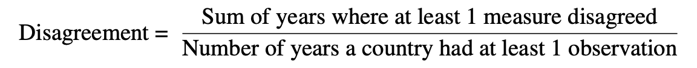
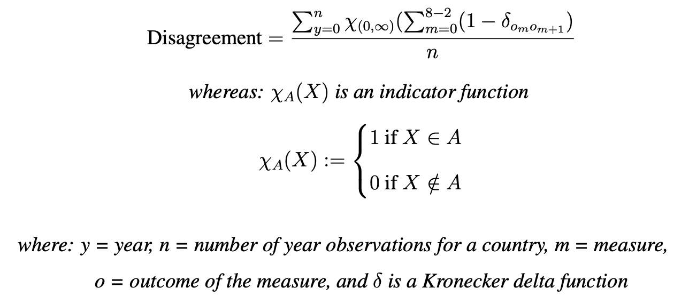

```{r setup, include=FALSE}
knitr::opts_chunk$set(echo = TRUE)
```

```{r, message=FALSE, warning=FALSE}
library(tidyverse)
library(ggplot2)
library(irr)
library(DescTools)
library(kableExtra)
load("./My_Raw_Data.RData")
```

# Data Descriptives

### Distinct rows 

```{r, message=FALSE, warning=FALSE}
dim(total)  # dimension of total merged dataset
dim(total%>%distinct()) # dimension of dataset with only distinct rows 
```

Since there is a difference in number of rows between raw data set compared to dataset with only distinct rows, the below code investigates what measures have duplicates:

```{r, message=FALSE, warning=FALSE}
total %>%
  group_by(measure, year, extended_country_name, outcome) %>%
  count() %>%
  filter(n > 1) %>%
  ungroup() %>%
  select(measure, n) %>%
  unique()
```

These seem like data entry errors and only distinct rows will be used for further analysis. 

### Descriptives table

The below code creates the descriptives of the merged dataset. I extract for each measure the year range, number of countries with observations, and percentage missingness. 

I had to seperate the calculation of eiu and the other measures because it gave an error since eiu has 0% missingness. 

```{r, message=FALSE, warning=FALSE}
results <- total %>%
  distinct() %>%
  select(measure, year, extended_country_name) %>%
  filter(measure != "eiu") %>%
  group_by(measure) %>%
  mutate(
    min_year = min(year),
    max_year = max(year),
    year_range = max_year - min_year,
    country_count = n_distinct(extended_country_name),
    perc_missing = table(extended_country_name, year) %>%
        as.data.frame() %>%
        mutate(total = nrow(.)) %>%
        filter(Freq == 0) %>% 
      mutate(percentage = round(nrow(.)*100 / total, 2) ) %>%
      pull(percentage) %>%
      unique()
         ) %>%
  select(measure, min_year, max_year, year_range, country_count, perc_missing) %>%
  unique()

eiu_results <-  total %>%
  distinct() %>%
  select(measure, year, extended_country_name) %>%
  filter(measure == "eiu") %>%
  mutate(
    measure = "eiu",
    min_year = min(year),
    max_year = max(year),
    year_range = max_year - min_year,
    country_count = n_distinct(extended_country_name),
    perc_missing = round(0, 2)) %>%
  select(measure, min_year, max_year, year_range, country_count, perc_missing) %>%
  unique()

desc_results <- rbind(results, eiu_results) 
desc_results %>%
  kable()
```

# Calculating convergence

### Calculation





```{r, message=FALSE, warning=FALSE}
outsum <- total %>%
  distinct() %>%
  select(year, extended_country_name, outcome) %>%
  group_by(extended_country_name, year) %>%
  mutate(sample = sum(!is.na(outcome)),
         dem = sum(outcome=="democratic"),
         nonDem = sum(outcome=="non-democratic")) %>%
  select(year, extended_country_name, sample, dem, nonDem) %>%
  mutate(variance = case_when(
    dem < sample & dem != 0 ~ TRUE,
    TRUE ~ FALSE
  ))

rate_of_var <- outsum %>%
  mutate(extended_country_name = as.factor(extended_country_name)) %>%
  group_by(extended_country_name, variance) %>%
  count() %>%
  rename(var_count = n) %>%
  ungroup() %>%
  group_by(extended_country_name) %>%
  mutate(country_count = sum(var_count)) %>%
  filter(variance == TRUE | var_count == country_count) %>%
  mutate(a = 0.05) %>%
  # using binomial confidence intervals 
  mutate(p = case_when(
    variance == TRUE ~ var_count / country_count,# that there is some disagreement between measures
    TRUE ~ 0
    ),
        ci_upp = case_when(
    variance == TRUE ~ p + qnorm(1-a/2)*sqrt((1/country_count)*p* (1-p)),
    TRUE ~ 0
    ),
        ci_low = case_when(
    variance == TRUE ~ p - qnorm(1-a/2)*sqrt((1/country_count)*p* (1-p)),
    TRUE ~ 0)
    ) %>%
  select(extended_country_name, var_count, country_count, p, ci_low, ci_upp)
```


### Map Visualisation

I first matched as many countries in my merged data as I could manually with the world map data.

```{r, message=FALSE, warning=FALSE}
world <- map_data("world")

levels(rate_of_var$extended_country_name)[levels(rate_of_var$extended_country_name)=="United States of America"] <- "USA" 
levels(rate_of_var$extended_country_name)[levels(rate_of_var$extended_country_name)=="United Kingdom"] <- "UK" 
levels(rate_of_var$extended_country_name)[levels(rate_of_var$extended_country_name)=="Congo"] <- "Republic of Congo" 
levels(rate_of_var$extended_country_name)[levels(rate_of_var$extended_country_name)=="Iran (Persia)"] <- "Iran" 
levels(rate_of_var$extended_country_name)[levels(rate_of_var$extended_country_name)=="Cambodia (Kampuchea)"] <- "Cambodia" 
levels(rate_of_var$extended_country_name)[levels(rate_of_var$extended_country_name)=="Italy/Sardinia"] <- "Italy" 
levels(rate_of_var$extended_country_name)[levels(rate_of_var$extended_country_name)=="Sri Lanka (Ceylon)"] <- "Sri Lanka" 
levels(rate_of_var$extended_country_name)[levels(rate_of_var$extended_country_name)=="Russia (Soviet Union)"] <- "Russia" 
levels(rate_of_var$extended_country_name)[levels(rate_of_var$extended_country_name)=="Belarus (Byelorussia)"] <- "Belarus" 
levels(rate_of_var$extended_country_name)[levels(rate_of_var$extended_country_name)=="Congo, Democratic Republic of (Zaire)"] <- "Democratic Republic of the Congo" 
levels(rate_of_var$extended_country_name)[levels(rate_of_var$extended_country_name)=="Madagascar (Malagasy)"] <- "Madagascar" 
levels(rate_of_var$extended_country_name)[levels(rate_of_var$extended_country_name)=="Myanmar (Burma)"] <- "Myanmar" 
levels(rate_of_var$extended_country_name)[levels(rate_of_var$extended_country_name)=="Turkey (Ottoman Empire)"] <- "Turkey"
levels(rate_of_var$extended_country_name)[levels(rate_of_var$extended_country_name)=="Zimbabwe (Rhodesia)"] <- "Zimbabwe"
levels(rate_of_var$extended_country_name)[levels(rate_of_var$extended_country_name)=="Trinidad and Tobago"] <- "Trinidad"
levels(rate_of_var$extended_country_name)[levels(rate_of_var$extended_country_name)=="Bosnia-Herzegovina"] <- "Bosnia and Herzegovina"
levels(rate_of_var$extended_country_name)[levels(rate_of_var$extended_country_name)=="Burkina Faso (Upper Volta)"] <- "Burkina Faso"
levels(rate_of_var$extended_country_name)[levels(rate_of_var$extended_country_name)=="Korea, Republic of"] <- "South Korea"
levels(rate_of_var$extended_country_name)[levels(rate_of_var$extended_country_name)=="Korea, People's Republic of"] <- "North Korea"
levels(rate_of_var$extended_country_name)[levels(rate_of_var$extended_country_name)=="Palestine, State of"] <- "Palestine"
levels(rate_of_var$extended_country_name)[levels(rate_of_var$extended_country_name)=="Tanzania/Tanganyika"] <- "Tanzania"
levels(rate_of_var$extended_country_name)[levels(rate_of_var$extended_country_name)=="East Timor"] <- "Timor-Leste"
levels(rate_of_var$extended_country_name)[levels(rate_of_var$extended_country_name)=="Kyrgyz Republic"] <- "Kyrgyzstan"
levels(rate_of_var$extended_country_name)[levels(rate_of_var$extended_country_name)=="Surinam"] <- "Suriname"
levels(rate_of_var$extended_country_name)[levels(rate_of_var$extended_country_name)=="Vietnam, Democratic Republic of"] <- "Vietnam"
levels(rate_of_var$extended_country_name)[levels(rate_of_var$extended_country_name)=="Yemen (Arab Republic of Yemen)"] <- "Yemen"
levels(rate_of_var$extended_country_name)[levels(rate_of_var$extended_country_name)=="Macedonia (Former Yugoslav Republic of)"] <- "North Macedonia"
levels(rate_of_var$extended_country_name)[levels(rate_of_var$extended_country_name)=="German Federal Republic"] <- "Germany"
levels(rate_of_var$extended_country_name)[levels(rate_of_var$extended_country_name)=="Cote D'Ivoire"] <- "Ivory Coast"
```

```{r, message=FALSE, warning=FALSE}
map_plot <- world %>%
  tbl_df() %>%
  full_join(rate_of_var, by=c(region="extended_country_name")) %>%
  ggplot(aes(long, lat, group=group, fill=p*100)) + 
  geom_polygon(color = "black", size = 0.05) +
  scale_fill_viridis_c(na.value = "dark grey") +
  theme(
  panel.background = element_rect(fill = "lightblue",
                                colour = "lightblue",
                                size = 0.5, linetype = "solid"),
  panel.grid.major = element_line(size = 0, linetype = 'solid',
                                colour = "white"), 
  panel.grid.minor = element_line(size = 0, linetype = 'solid',
                                colour = "white"),
  axis.text.y=element_blank(),
  axis.ticks.y=element_blank(),
  axis.text.x=element_blank(),
  axis.ticks.x=element_blank() 
  ) +
  labs(fill = "Disagreement (%)", 
       title = "Disagreeability between democracy measures", 
       x = "",
       y = "") 
ggsave("./Figures/disagreeability.png", width = 18, height = 10, units = "cm")
```

# Statistical method of measuring disagreement 

```{r, message=FALSE, warning=FALSE}
years_object_list <- list()
kappa_list <- list()

years <- total %>%
  distinct() %>%
  select(year) %>%
  unique() %>%
  as.list()

for (y in min(years$year):max(years$year)) {
  subset_df <- total %>%
    distinct() %>%
    filter(year == y) 
  wide_subset <- subset_df %>%
    pivot_wider(names_from = measure, values_from = outcome) %>%
    as.data.frame() %>%
    select(-year, -extended_country_name)
  k <- KappaM(wide_subset, method = "Fleiss", conf.level = 0.95)
  res <- c(y, k)
  years_object_list <- append(years_object_list, list(subset_df))
  kappa_list <- append(kappa_list, list(res))
}

kappa_df <- as.data.frame(do.call(rbind, kappa_list)) %>%
  rename(year = V1)

above_0 <- kappa_df %>%
  filter(kappa > 0)

mean_kappa <- mean(kappa_df$kappa, na.rm = TRUE)
```

mean = 0.630451
mean for kappa above 0 (rm 1800 and 2020) = 0.637808

### Visualisations

```{r, message=FALSE, warning=FALSE}
full_kappa <- ggplot(kappa_df, aes(year, kappa)) +
  geom_errorbar(aes(ymin=lwr.ci, ymax=upr.ci), width=.1, position=position_dodge(0.1))+
  geom_point(position = position_dodge(0.1)) +
  geom_hline(yintercept = mean(kappa_df$kappa, na.rm = TRUE), color="blue") +
  ggtitle("Inter-measure agreement over time using Fleiss' Kappa") +
  xlab("Year") +
  ylab("Kappa Value")
full_kappa
ggsave("./Figures/full_kappa.png", width = 18, height = 14, units = "cm")
```

```{r, message=FALSE, warning=FALSE}
above0_kappa <- ggplot(above_0, aes(year, kappa)) +
  geom_errorbar(aes(ymin=lwr.ci, ymax=upr.ci), width=.05, position=position_dodge(0.1))+
  geom_point(position = position_dodge(0.1)) +
  geom_hline(yintercept = mean(kappa_df$kappa, na.rm = TRUE), color="blue") +
  ggtitle("Inter-measure agreement over time using Fleiss' Kappa (removed outliers)") +
  xlab("Year") +
  ylab("Kappa Value")
above0_kappa
ggsave("./Figures/above0_kappa.png", width = 18, height = 14, units = "cm")
```

